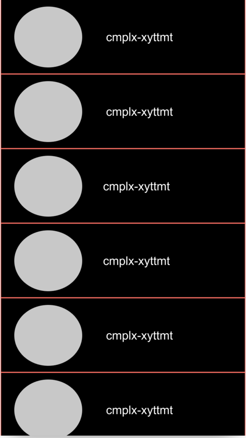
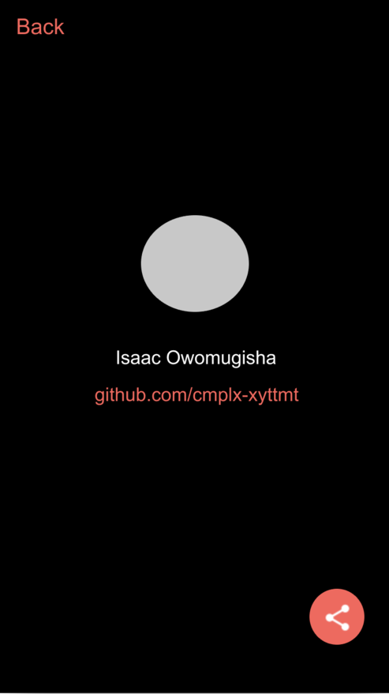
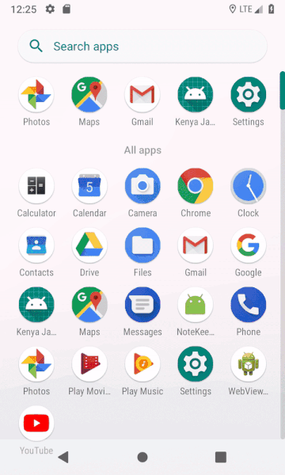

[](https://circleci.com/gh/cmplx-xyttmt/KenyaJavaDevs)
[](https://travis-ci.org/cmplx-xyttmt/KenyaJavaDevs)
[](https://codecov.io/gh/cmplx-xyttmt/KenyaJavaDevs)
[](https://codeclimate.com/github/cmplx-xyttmt/KenyaJavaDevs/maintainability)

# Kenya Java Devs
Kenya Java Devs is an android that retrieves a list of Java Developers
in Nairobi using the [Github API](https://developer.github.com/v3/).

## Getting Started
Below are the instructions to to get this repository setup on your
local machine.

### Prerequisites
Make sure you have the following installed:
- [Java Development Kit](https://www.oracle.com/technetwork/java/javase/downloads/jdk8-downloads-2133151.html)
- [Android Studio](https://developer.android.com/studio/)
- [Git](https://git-scm.com/)

### Installing
- Clone this repo using:
```
git clone https://github.com/cmplx-xyttmt/KenyaJavaDevs.git
```
- Open Android Studio and import the project created above.
- Click the green play icon and run the app in an emulator or connected device.
Alternatively, go to **Build**>**Build Bundle(s) / APK(s)**>**Build APK(s)** to
generate an apk for the project; then install this apk on your device.

## Running the tests
To run the tests and generate a coverage report, run the following command:
```
./gradlew jacocoTestReport
```

You can find the html coverage report in the `app/build/reports/coverage/debug/index.html`
folder.

## Mockups

&nbsp;&nbsp;&nbsp;&nbsp;&nbsp;

## Demo
The final app looks as follows:



## Built With
- [Java](https://www.java.com/en/download/)
- [Android Studio](https://developer.android.com/studio/)

## Authors
[**Isaac Owomugisha**](https://github.com/cmplx-xyttmt)
